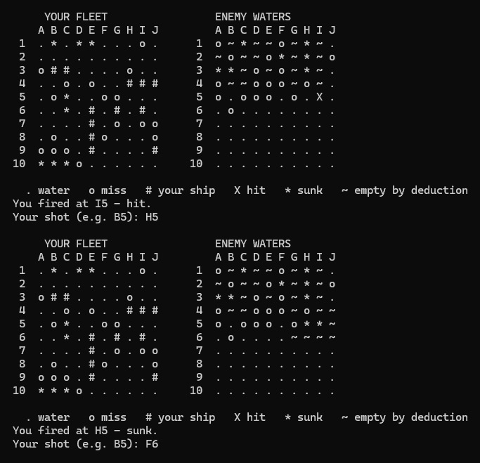
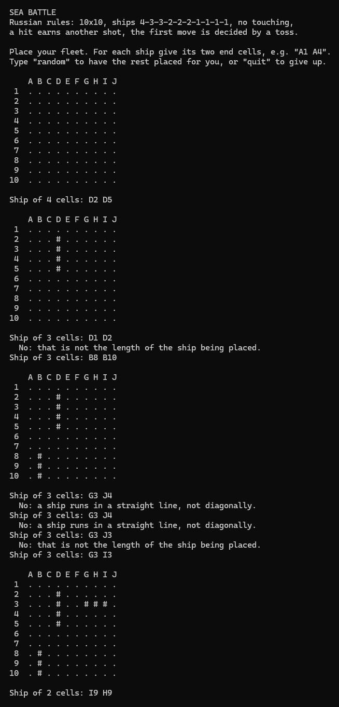
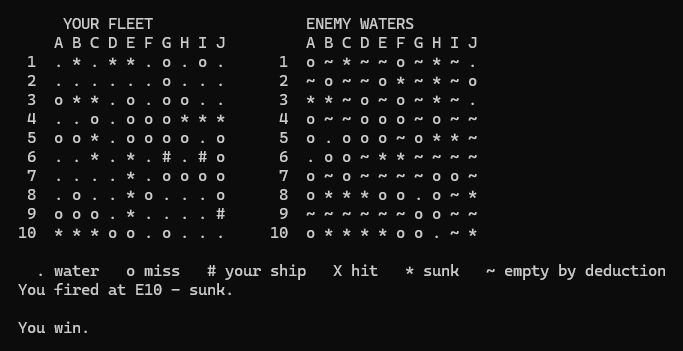
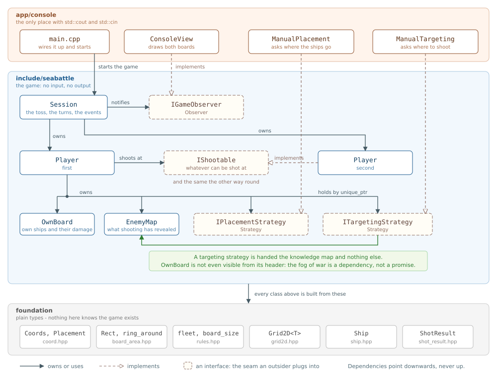

# Sea Battle

The Russian variant of Battleship, written in C++17 as a game-rules library with
a console application on top of it.

The library does no input and no output at all. A complete game between two
computer players runs without printing a character, which is what makes it
possible to play tens of thousands of games and measure how good a strategy is.
The console is one client of that library, and it plugs into it through the
same interfaces anybody else would use.

---

## Playing

    cmake -B build
    cmake --build build
    ./build/app/console/seabattle_console

You play against the computer. At the start you are asked whether to lay out
your fleet yourself:

| you type | meaning |
|---|---|
| `y` / `n` | place the ships yourself, or let the computer do it |
| `A1 A4` | a ship's two end cells; a one-cell ship needs only one |
| `random` | give up on placing by hand and lay out the whole fleet at random |
| `quit` | leave |
| `B5` | a shot: the column letter, then the row number |

The two boards are drawn side by side after every shot:

| symbol | meaning |
|---|---|
| `.` | water, or a cell nothing is known about |
| `o` | a shot that found water |
| `#` | an undamaged deck - only ever visible on your own board |
| `X` | a damaged deck of a ship that is still afloat |
| `*` | a cell of a ship that has gone down |
| `~` | known to be empty without a shot: it touches a sunk ship |

A cell you have already resolved is refused before the shot is sent, so a
mistyped repeat never costs a turn.

The game ends when one fleet is gone:

---

## Rules

The Russian variant:

* a 10×10 board;
* one four-cell ship, two three-cell, three two-cell and four one-cell;
* ships may not touch, not even at the corners;
* a hit earns another shot, a miss passes the turn;
* the first move is decided by a coin toss.

This is not the Hasbro game, which uses a 5-4-3-3-2 fleet, lets ships touch,
always passes the turn and names the ship that was sunk. Two of the protocol
decisions below depend on the Russian rules and would break under Hasbro's.

---

## Architecture

Three layers, and every dependency points downwards:

* **`app/console`** - the only code that touches `std::cout` and `std::cin`.
  Apart from `main.cpp`, everything in it implements an interface the library
  publishes.
* **`include/seabattle`** - the game. `Session` owns both players and runs the
  turns; each `Player` owns its board and its knowledge of the opponent, and is
  handed two strategies it does not know the type of.
* **foundation** - plain value types (`Coords`, `Grid2D<T>`, `Ship`,
  `ShotResult`, the rules) that know nothing about the game built on them.

The four dashed boxes are the only places the system is meant to be extended,
and extending it through them does not change a line of the existing code.

---

## Design decisions

Each entry says what was chosen, why, and what the alternative was.

### Layering

**The rules library has no input or output.** Everything a person sees or types
lives in `app/console`. The payoff is testability and replaceability: a game is
a function call, and a different front end - graphical, networked, a replay
viewer - is a new directory, not a rewrite. The alternative, printing from
inside the game, is the usual reason a console game cannot be tested at all.

**The fog of war is enforced by the include graph.** `targeting_strategy.hpp`
includes `enemy_map.hpp` and not `own_board.hpp`, so a targeting strategy
cannot look at its own player's ships: the type is not even visible from there.
The own board and the knowledge map also have *different* cell types - "unknown"
cannot occur on one's own board, "intact deck" cannot occur on the opponent's -
so mixing the two up is a compile error rather than a silent bug.

### Interfaces

**Placement and targeting are strategies.** A human and an algorithm implement
the same interface, and a player cannot tell which it was given. The
alternative - a player that checks "am I human?" and branches - puts input code
into the engine and makes every new kind of opponent a change to `Player`.

**A player shoots at an `IShootable`, not at another `Player`.** This is the
dependency inversion principle applied to the one link between the two sides.
It buys two things. A player can be tested alone, against a few lines that
answer whatever the test needs, with no second board or fleet in existence. And
the opponent no longer has to live in the same process: an adapter that sends
the coordinate over a socket and returns the answer looks the same from here.

*Rejected: a channel object between the players (Mediator).* It gives the same
two benefits, but in a single process it is a layer that only forwards a call.
The interface gives them without the extra object.

**Events reach the outside world through an observer.** `Session` notifies any
number of `IGameObserver`s - zero during a measurement run, one when playing the
computer, two for two humans. An event travels one way and nothing is expected
back, which is exactly what the observer pattern is for.

*Rejected: an observer for the shot itself.* A shot needs an answer - miss, hit
or sunk - and a notification cannot return one. The same pattern fits the
events and does not fit the exchange, and the difference is that one word.

### The protocol between players

**A shot is a function call and its outcome is the return value.** The shooter
calls `receive_shot(at)` on its opponent and gets a `ShotResult` back. In a
single process that is an ordinary nested call; over a network it would be a
blocking send and receive, and it would look the same to the caller.

*Rejected: a message queue.* The game is strictly turn-based - at any moment
exactly one player is deciding - so there is no concurrency in the problem to
model. A queue in one thread needs someone outside to pump it, because a player
that waits on an empty queue waits forever: the only thread is the one waiting.

**"Sunk" carries no coordinates.** The shooter reconstructs the ship from its
own hit marks, walking outwards from the last hit in the four directions. This
works precisely because ships may not touch: a hit cell of another ship can
never be orthogonally adjacent. Checked by brute force over 200,000 sinkings
with ships and cells hit in random order - no errors. With touching allowed the
same reconstruction fails in more than a quarter of cases, and the coordinates
would have to be in the message.

**There is no "you won" and no "you lost".** Each side derives the outcome: the
loser from its own board, the winner by counting sinkings on its map. A result
both sides can work out cannot then be forgotten to be sent.

**A refused shot is not an outcome.** Firing at a cell that has already been
resolved returns an empty `std::optional<ShotResult>` rather than a fourth
enumerator. An outcome changes a cell and decides whose turn is next; a refusal
does neither, and putting it among the outcomes would put a "nothing happened"
case into every `switch` over things that did happen. The refusal is also a
second line of defence: the shooter can see on its own map that the cell is
resolved, and filters the repeat before sending it.

**There is no referee.** Each player holds only its own board and has no copy
of the opponent's, so hidden information stays hidden by construction. The
other side of that coin: nothing checks that an opponent answers honestly. In
one process this cannot matter; across a network it would.

### Representing the board

**A cell is a `std::variant<WaterCell, ShipCell>`.** Water that carries a ship
index cannot be expressed, instead of being forbidden by a comment.

**Cells refer to ships by index, not by pointer.** A pointer into a
`std::vector` dangles when the vector reallocates, and a copy of the board
would still point at the original's ships. With an index the board stays on the
Rule of Zero.

**Whether a ship is sunk lives in the ship, not in its cells.** The board
answers `is_sunk_at(cell)` as a question. Storing it in every cell as well would
be the same fact in several places, with room to disagree.

**The whole fleet is deployed in one call, and the board checks it.**
`OwnBoard::deploy` receives the complete list, validates all of it, and writes
nothing unless every ship is legal - so the board is either complete or
untouched, with no rollback code. A per-ship method could not have checked that
the list matches the fleet at all. The board re-checks what the placement
strategy has already checked because a strategy may be a person, or code
somebody else wrote.

**On the knowledge map, "sunk" replaces "hit".** That gives the invariant a
targeting strategy relies on: every hit cell belongs to a ship still afloat. As
a result the targeting strategy has no memory of its own - which cell it tried
last, which direction it was following - because everything it needs is on the
map, and a remembered copy would be a second source of truth.

### Lifetime and reproducibility

**`Session` owns both players; players are neither copyable nor movable.** Two
players point at each other, so moving one would leave the other holding a stale
address. Deleting the move operations turns that into a compile error at the
exact line where it would have happened (`std::vector<Player>` does not compile).
It does not protect against lifetime - which is why one object owns both and
outlives them.

**Every source of randomness is seeded from outside.** Fleet layout, targeting
and the coin toss each take a seed in their constructor. The same seeds replay
the same game move for move, which is what turns a strange game into a bug
report instead of an anecdote.

---

## Extending it

Each row is a change somebody might actually want, what it takes, and what stays
untouched. The interfaces in the diagram exist so that this table is short.

| to add | you write | what does not change |
|---|---|---|
| a stronger computer opponent | one class implementing `ITargetingStrategy` | everything else |
| another front end - a log file, a replay viewer, a GUI | an `IGameObserver`, plus manual strategies if a person plays | the whole library |
| an opponent on another computer | an `IShootable` that sends the coordinate over a socket and returns the reply, and on the far side a loop that hands incoming shots to the local player | `Player`, both boards, both strategies |
| a different fleet or board size | an edit in `rules.hpp` | everything - see below |

Two honest caveats. For a network game `Session` is the one piece that would be
replaced: today it builds both players in the same process. And a GUI cannot
block on input the way the console does, so its manual strategies would need
the control flow reworked - the protocol itself would not.

The rules are a single source of truth. The number of ships and the shortest
and longest ship are *computed* from the fleet rather than written down a second
time, so changing the fleet changes every check that depends on it. The console
handles boards up to 26 columns wide, one letter each. The one rule that must
not change is "ships may not touch": the protocol depends on it, as described
above.

### What is reused

* **`Grid2D<T>`** was written for an earlier, unrelated exercise and brought
  over with nothing changed but its namespace. The own board, the knowledge map
  and the placement strategy's scratch grid are all `Grid2D` over three
  different cell types.
* **`ring_around()`** lives in `board_area.hpp` because two parts that must not
  know about each other need the same rectangle: the placement strategy blocks
  it so no later ship can touch the one just placed, and the knowledge map
  crosses it out after a sinking. It was moved there when the second user
  appeared, not in anticipation of one.
* **`coord_format`** is the only code in the program that knows a cell has a
  letter. The engine speaks `Coords{row, col}`; a network channel would speak
  bytes; "B5" exists only at the edge where a person reads and types.

### How it was built

* **Designed before written.** The architecture was settled in prose - what
  each object owns, what crosses between players, where input may appear -
  before the first header existed.
* **Decisions recorded where they apply.** Every header opens with the design
  notes for what it contains, and every public function documents its contract
  (`@pre`, `@invariant`, what happens on refusal). The "Design decisions"
  section above is those notes, collected.
* **Invalid states made unrepresentable** rather than checked for: a variant
  instead of a status plus an index, two cell types instead of one, a refusal
  in the return type instead of among the outcomes.
* **Measured before decided.** The checkerboard search looked like an obvious
  improvement; measured over 20,000 games it saved 1.3 shots and was dropped.
* **The compiler as a reviewer.** Strict warnings on three compilers,
  AddressSanitizer and UndefinedBehaviorSanitizer, and deleted operations where
  a misuse should fail to compile rather than fail at run time.

---

## Object-oriented design

Object orientation is used where the design needs substitution at run time,
and deliberately not used where it does not.

### The four principles

* **Encapsulation.** State is private and changed through one door. A `Ship`'s
  length and damage have no setters; a cell and its ship change together only
  inside `OwnBoard::receive_shot`; the knowledge map changes only through
  `EnemyMap::record`. Each class states its invariants (`@invariant`) and keeps
  them itself instead of trusting its callers to.
* **Abstraction.** Four interfaces - `IPlacementStrategy`, `ITargetingStrategy`,
  `IShootable`, `IGameObserver` - tell a caller *what* happens and hide *how*.
* **Inheritance - of interfaces only.** `Player` implements `IShootable`, the
  strategies implement theirs, `ConsoleView` implements `IGameObserver`. There
  is no inheritance of implementation anywhere. `Grid2D` in particular is held,
  not inherited from: public inheritance would expose `at()` and `fill()` past
  the boards' invariants, and `Grid2D` has no virtual destructor.
* **Polymorphism - three kinds, each where it fits.** Run-time polymorphism
  through the four interfaces; parametric polymorphism through `Grid2D<T>`,
  used with three unrelated cell types; and a closed set of alternatives
  through `std::variant` for a cell of one's own board.

### SOLID

| | principle | in this code |
|---|---|---|
| **S** | single responsibility | `OwnBoard` - one's own fleet; `EnemyMap` - knowledge of the other; `Session` - the flow of the game; `ConsoleView` - drawing; `coord_format` - turning "B5" into a coordinate |
| **O** | open for extension, closed for modification | a new strategy or a new front end is added without touching `Player` or `Session` |
| **L** | Liskov substitution | any `ITargetingStrategy` can replace another because its contract is written down - "returns a cell that is still unknown"; a scripted test double replaces a whole `Player` behind `IShootable` |
| **I** | interface segregation | `IShootable` has one method; the one optional observer event has an empty default body |
| **D** | dependency inversion | `Player` depends on four abstractions and is handed their implementations from outside |

### Where object orientation is deliberately not used

* **A cell is a `std::variant`, not a base class with subclasses.** The set of
  alternatives is closed and known in advance, a board has a hundred cells, and
  none of them needs a heap allocation or a virtual call. A hierarchy is the
  right tool when the set is open; here it is not.
* **`Coords`, `Placement` and `Rect` are plain aggregates.** They are data, not
  objects with behaviour, and wrapping them in accessors would add nothing.
* **The placement algorithm's helpers are free functions.** They need no state,
  so they are not methods of anything - which also makes each one testable on
  its own.

---

## Patterns and principles

| | where | why |
|---|---|---|
| **Strategy** | `IPlacementStrategy`, `ITargetingStrategy` | a human and an algorithm are interchangeable |
| **Observer** | `IGameObserver` | events go out, nothing comes back, any number of listeners |
| **Dependency injection** | strategies passed to `Player` as `std::unique_ptr` by value | the transfer of ownership is written in the type |
| **Dependency inversion** | `Player` depends on `IShootable`, not on `Player` | testable alone; the opponent can be remote |
| **Interface segregation** | `IShootable` has one method | a test double implements one method, not twenty |

Considered and rejected, with the reasons above: **Mediator** between the
players, and **Observer** for the shot exchange.

---

## Measurements

Average number of shots needed to sink the whole fleet, over 20,000 random
fleets per row:

| targeting | shots |
|---|---:|
| random among unknown cells, no finishing off | 75.0 |
| `SimpleTargetingStrategy`: random, then finish off a damaged ship | 58.1 |
| the same, searching on a checkerboard pattern | 56.8 |

The checkerboard saves only 1.3 shots, so it did not become a class of its own.
Four of the ten ships are one cell long and a checkerboard cannot corner them,
and crossing out the ring around every sunk ship has already removed most of
what the pattern would have saved.

A full game between two `SimpleTargetingStrategy` players takes 104.6 shots on
average (50,000 games).

---

## Layout

    include/seabattle/     the library - rules, no input or output
    app/console/           the console application - the only place with cout and cin
    docs/                  the architecture diagram and screenshots
    tests/                 tests - see "Next" below

---

## Building

Requires CMake 3.15 and a C++17 compiler; built with MSVC, GCC and Clang.

    cmake -B build
    cmake --build build

The warning set is deliberately strict (`/W4 /permissive-` on MSVC; `-Wall
-Wextra -Wpedantic -Wconversion -Wsign-conversion -Wshadow` and more on GCC and
Clang). To treat warnings as errors, or to build with AddressSanitizer and
UndefinedBehaviorSanitizer:

    cmake -B build -DSEABATTLE_WERROR=ON
    cmake -B build -DSEABATTLE_SANITIZE=ON

---

## Next

* **Tests in the repository.** Everything described above was checked during
  development, but those checks do not live in `tests/` yet.
* **Continuous integration** on GCC, Clang and MSVC, with sanitizers.
* **A probability-map targeting strategy**: for every unknown cell, count the
  ways the ships still afloat could cover it, and fire where that number is
  largest. The numbers to beat are in the table above.
* **A network opponent** - an `IShootable` adapter over a socket. The engine
  would not change.
